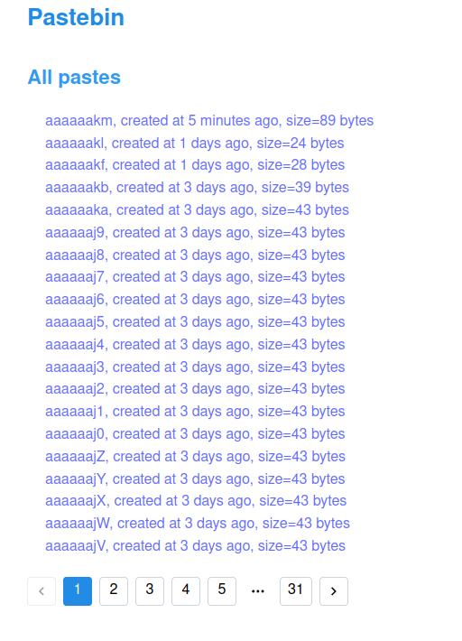

# Simple Pastebin

## Notes:

- Use Base62 to encode the auto-increment ID in PostgreSQL to create a shortlink
- The paste context is stored in filesystem (will be store in AWS S3 if I have a time to do it)
- Using pagination to display the list of pastes
- Index the paste context using ElasticSearch to quickly find the paste path in filesystem when using search engine

## A simple UI as below:

**Create new paste and list of recent created pastes**

**Search result**

**Display detail of each paste**

**All pages pagination**

**TODO**: add paste context to AWS S3
